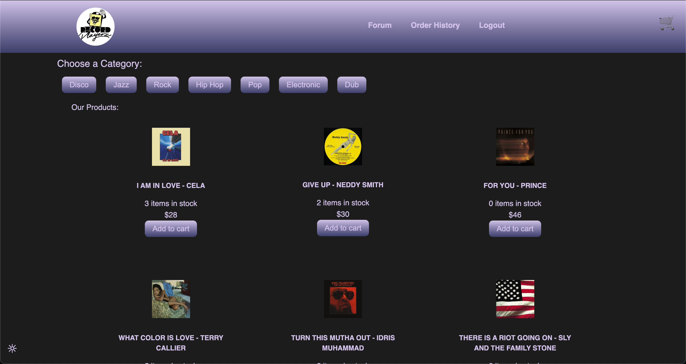
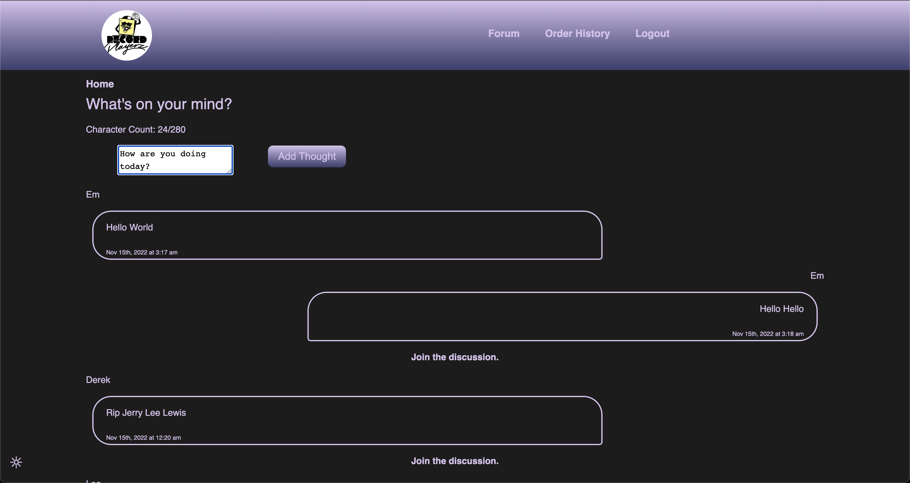
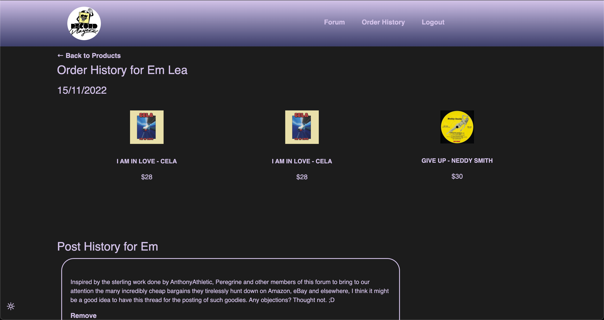

# 23 Final Project: MERN Stack Single-Page Application

# Project : Record-Store

## Description

Working individually we were tasked to build a MERN Stack Single-Page Application of our choosing. This project provided the opportunity to demonstrate and implement the skills and knoweledge we have learnt since starting our web-development journey.

While we had the option to choose our own application the project had to include the following:

### Project Requirements

- Use React for the front end.

- Use GraphQL with a Node.js and Express.js server.

- Use MongoDB and the Mongoose ODM for the database.

- Use queries and mutations for retrieving, adding, updating, and deleting data.

- Be deployed using Heroku (with data).

- Have a polished UI.

- Be responsive.

- Be interactive (i.e., accept and respond to user input).

- Include authentication (JWT).

- Protect sensitive API key information on the server.

- Have a clean repository that meets quality coding standards (file structure, naming conventions, best practices for class and id naming conventions, indentation, high-quality comments, etc.).

The application that was created was called _Record Store_; an e-commerce store for people who love music, DJs, collectors and those who just want to be on track with the latest news.
 
 

To view the applicatoin [click here and you will be directed to the live webpage](https://intense-beach-26403.herokuapp.com/)

# Table of Contents

- [Description](#description)
- [Installation](#installation)
- [Usage](#usage)
- [Features](#features)
   

## Installation

Assuming the application has successfully been cloned there are a few small steps that need to be followed so that the user can install the application.  

First, in the root directroy the user must open the command line and enter  
'npm i'
 
this will allow all the npm dependencies to be installed.

Once the installatin has complete the user must 'seed' the application. Seeding the application is important as it means the products and user information will be created.  

This is done by inputing into the command line  
'npm run seed'
 
The user will see a message in the command line once all the seeds have completed seedinng.  
 
The last step to complete installation is to input 'npm run develop' in the root directoy. This allows the 'front end and back end' (server and client folders) to run concurrenty.

Once this is done a window will automically open displaying the application.

## Usage

The application is straightforward and intuitive to use.

When the application first loads the user will see the homepage.

Here they can login, signup, view the products.

After loggin in or signing up the user will also have access to the forum page, where they can post or interract with other users by commenting on their posts.

Finally , the user can access their history tab, where will be presented with their purchase history as well as posts history.

 
 
 
 

## Features

This application was made up of the following features:

- apollo-client
- bcrypt
- concurrently
- dotenv
- express
- graphQL
- JWT-decode
- mongoose
- node.js
- nodemon
- react
- react-dom
- react-router-dom
- react-scripts
